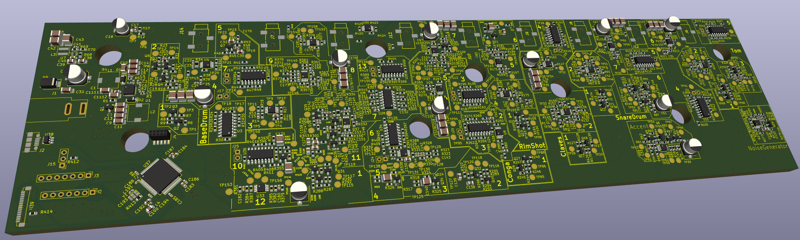
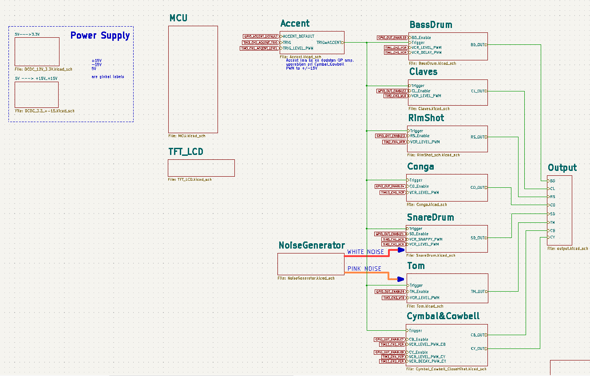
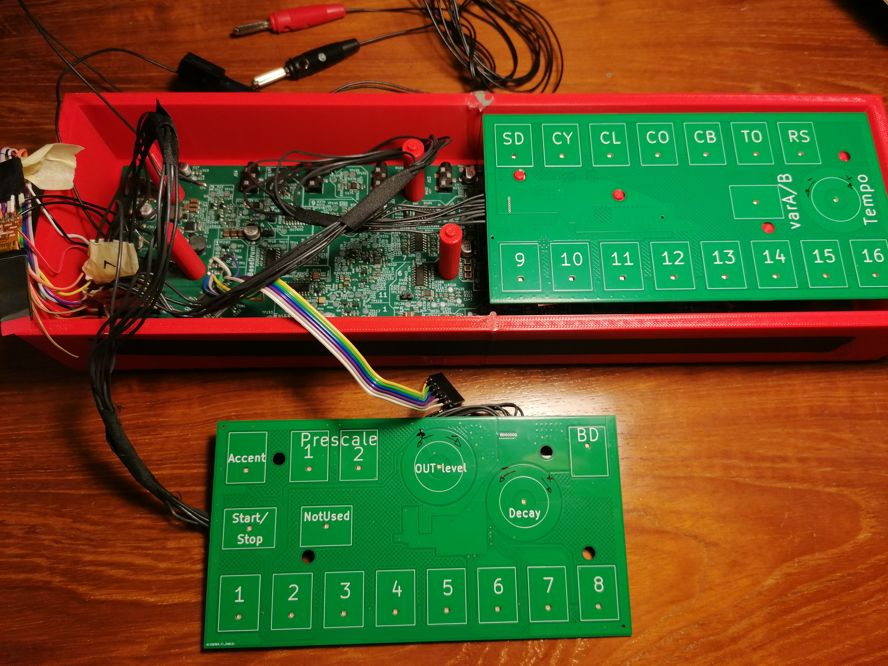

# Replica of ROLAND 808 Kick-Drum machine

The inspiration for this project comes from the Roland 808 Kick Drum and its analog instruments.
I used the 808's analog circuits but removed all potentiometers, replacing them with voltage-controlled 
resistors implemented using the LM13700 transconductance amplifier. All analog instrument circuits were 
simulated in MicroCap 12, and the corresponding [.cir files are available](./Circuit%20simulation%20(MicroCap12)/).
For controlling both front panels, the TFT screen, and all analog components, an STM32F405RGT microcontroller (LQFP64 package) is used.

# Block diagram

# Current project status

